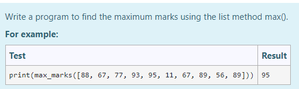
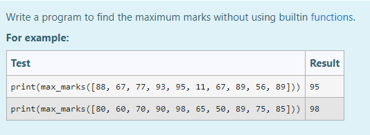

# Find the maximum of a list of numbers
## Aim:
To write a program to find the maximum of a list of numbers.
## Equipment’s required:
1.	Hardware – PCs
2.	Anaconda – Python 3.7 Installation / Moodle-Code Runner
## Algorithm:
1.	Get the list of marks as input
2.	Use the sort() function or max() function or use the for loop to find the maximum mark.
3.	Return the maximum value
## Program:

i)	# To find the maximum of marks using the list method sort.
```Python

#Program to mark the maximum of marks using the list method sort
#Developed by: Delli Priya L
#RegisterNumber: 22006375
def max_marks(marks):
    marks.sort()
    return marks[-1]
```

ii)	# To find the maximum marks using the list method max().
```Python

#Program to find the maximum marks using the list method max().
#Developed by: Delli Priya L
#RegisterNumber: 22006375
def max_marks(marks):
    large = max(marks)
    return large
```

iii) # To find the maximum marks without using builtin functions.
```Python

#Program to the maximum marks without using builtin functions.
#Developed by: Delli Priya L
#RegisterNumber: 22006375
def max_marks(list1):
    for i in list1:
        if i>=95:
           return i
        else:
            pass
```
## Sample Input and Output
 




## Output:


## Result:
Thus the program to find the maximum of given numbers from the list is written and verified using python programming.
